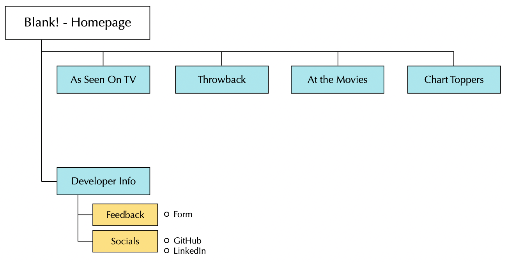

# Blank!


[View the live project here]()

## Table of contents
1. [Introduction](#Introduction)
2. [UX](#UX)
    1. [Ideal User Demographic](#Ideal-User-Demographic)
    2. [User Stories](#User-Stories)
    3. [Development Planes](#Development-Planes)
    4. [Design](#Design)
3. [Features](#Features)
    1. [Design Features](#Design-Features) 
    2. [Existing Features](#Existing-Features)
    3. [Features to Implement in the future](#Features-to-Implement-in-the-future)
4. [Issues and Bugs](#Issues-and-Bugs)
5. [Technologies Used](#Technologies-Used)
     1. [Main Languages Used](#Main-Languages-Used)
     2. [Additional Languages Used](#Additional-Languages-Used)
     3. [Frameworks, Libraries & Programs Used](#Frameworks,-Libraries-&-Programs-Used)
6. [Testing](#Testing)
     1. [Testing.md](TESTING.md)
7. [Deployment](#Deployment)
     1. [Deploying on GitHub Pages](#Deploying-on-GitHub-Pages)
     2. [Forking the Repository](#Forking-the-Repository)
     3. [Creating a Clone](#Creating-a-Clone)
8. [Credits](#Credits)
     1. [Content](#Content)
     2. [Media](#Media)
     3. [Code](#Code)
9. [Acknowledgements](#Acknowledgements)
***

## Introduction
Blank! is a web-based interactive game, designed to test your music knowledge!

This is the second of four Milestone Projects that the developer must complete during their Full Stack Web Development Program at The Code Institute. 

The main requirements were to design, develop and implement a dynamic front-end web application using **HTML5**, **CSS3** and **JavaScript**.

[Back to top ⇧](#blank)

## UX 

### Ideal User Demographic
#### The ideal user of this website is:
-

### User Stories
#### Goals:
1. 

#### Goals:
1. 

#### Goals:
1. 

#### Goals:
1. 

### Development Planes

In order to design and create a web-based interactive game, the developer worked closely with the artist to distinguish the required functionality of the site and how it would answer the user stories, as described above.

#### Strategy
Broken into three categories, the website will focus on the following target audiences:
- **Roles:**
     - New Players
     - Current Players
     - Returning Players

- **Demographic:**
     - Music Lovers
     - Aged 10 years and up
     -Quiz Lovers

- **Psychographics:**
     - Personality & Attitudes:
          - Extroverted
          - Fun-driven
          - Knowledgeable when it comes to music
     - Values:
          - Modern
          - Nostalgic
          - Friendship
     - Lifestyles:
          - Fun-seeking
          - Music interest
          - Competitiveness

The website needs to enable the **user** to:
- Play with easy, navigating without complications or instructions
- Choose their preferred music category
- Control sound settings
- Control light/dark settings
- See High Score
- Provide suggestions and feedback to the developer
- Connect with developer through social links

The website needs to enable the **client** to:
- Enjoy playing their own game
- Allow for user feedback and suggestions
- Communicate with users on social links

With these goals in mind, a strategy table was created to determine the trade-off between importance and viability with the following results:


#### Scope
A scope was defined in order to clearly identify what needed to be done in order to align features with the strategy previously defined. This was broken into two categories:
- **Content Requirements**
     - The user will be looking for:
          - Vibrant and engaging content
          - Easy navigation throughout the game
          - Easy play interface
          - Control of sound settings
          - High Scores
          - Developer information
- **Functionality Requirements**
     - The user will be able to:
          - Navigate to preferred music category
          - Play with ease
          - Toggle Day vs Night graphics
          - See High Score
          - Toggle sound effects on and off
          - Reach out to the developer
               - Suggestions
               - Social links

#### Structure
The information architecture was organized in a **hierarchial tree structure** in order to ensure that users could navigate through the site with ease and efficiency, with the following results: 



#### Skeleton 
Wireframe mockups were created in a [Figma Workspace]() with providing a positive user experience in mind:

**Main Page:**


**Game Mode:**


 Wireframe")

 Wireframe")

**Finished Page:**


**Form:**


#### Surface

**Colour Scheme**


**Typography**


**Imagery**


[Back to top ⇧](#blank)

## Features

### Design Features
<dl>
  <dt><a href="index.html" target="_blank" alt=""> </a></dt>
  <dd>
     <ul>
          <li></li>
          <li></li>
     </ul>
  </dd>

 
### Existing Features
- 

### Features to Implement in the future
- 

[Back to top ⇧](#blank)

## Issues and Bugs 


[Back to top ⇧](#blank)

## Technologies Used
### Main Languages Used
- [HTML5](https://en.wikipedia.org/wiki/HTML5 "Link to HTML Wiki")
- [CSS3](https://en.wikipedia.org/wiki/Cascading_Style_Sheets "Link to CSS Wiki")
- [JavaScript](https://en.wikipedia.org/wiki/JavaScript "Link to JavaScript Wiki")

### Frameworks, Libraries & Programs Used
- [Bootstrap](https://getbootstrap.com/docs/4.4/getting-started/introduction/ "Link to Bootstrap page")
     - Bootstrap was used to implement the responsiveness of the site, using bootstrap classes.
- [Google Fonts](https://fonts.google.com/ "Link to Google Fonts")
    - Google fonts was used to import the fonts "Shaodows Into Light Two" and "Roboto" into the style.css file. These fonts were used throughout the project.
- [Font Awesome](https://fontawesome.com/ "Link to FontAwesome")
     - Font Awesome was used on all pages throughout the website to import icons (e.g. social icons) for UX purposes.
- [Git](https://git-scm.com/ "Link to Git homepage")
     - Git was used for version control by utilizing the GitPod terminal to commit to Git and push to GitHub.
- [GitHub](https://github.com/ "Link to GitHub")
     - GitHub was used to store the project after pushing
- [Figma](https://www.figma.com/ "Link to Figma homepage")
     - Figma was used to create the wireframes during the design phase of the project.
- [Am I Responsive?](http://ami.responsivedesign.is/# "Link to Am I Responsive Homepage")
     - Am I Responsive was used in order to see responsive design throughout the process and to generate mockup imagery to be used.

[Back to top ⇧](#blank)

## Testing

Testing information can be found in a separate testing [file](TESTING.md "Link to testing file")

## Deployment

This project was developed using [Visual Studio Code Insiders](https://code.visualstudio.com/insiders/ "Link to Visual Studio Code site"), committed to git and pushed to GitHub using the computer terminal.

### Deploying on GitHub Pages
To deploy this page to GitHub Pages from its GitHub repository, the following steps were taken:

1. Log into [GitHub](https://github.com/login "Link to GitHub login page") or [create an account](https://github.com/join "Link to GitHub create account page").
2. Locate the [GitHub Repository](https://github.com/rebeccatraceyt/KryanLive "Link to GitHub Repo").
3. At the top of the repository, select Settings from the menu items.
4. Scroll down the Settings page to the "GitHub Pages" section.
5. Under "Source" click the drop-down menu labelled "None" and select "Master Branch".
6. Upon selection, the page will automatically refresh meaning that the website is now deployed.
7. Scroll back down to the "GitHub Pages" section to retrieve the deployed link.
8. At the time of submitting this Milestone project the Development Branch and Master Branch are identical.

### Forking the Repository
By forking the GitHub Repository we make a copy of the original repository on our GitHub account to view and/or make changes without affecting the original repository by using the following steps...

1. Log into [GitHub](https://github.com/login "Link to GitHub login page") or [create an account](https://github.com/join "Link to GitHub create account page").
2. Locate the [GitHub Repository](https://github.com/rebeccatraceyt/KryanLive "Link to GitHub Repo").
3. At the top of the repository, on the right side of the page, select "Fork"
4. You should now have a copy of the original repository in your GitHub account.

### Creating a Clone
How to run this project locally:
1. Install the [GitPod Browser](https://www.gitpod.io/docs/browser-extension/ "Link to Gitpod Browser extension download") Extension for Chrome.
2. After installation, restart the browser.
3. Log into [GitHub](https://github.com/login "Link to GitHub login page") or [create an account](https://github.com/join "Link to GitHub create account page").
2. Locate the [GitHub Repository](https://github.com/rebeccatraceyt/KryanLive "Link to GitHub Repo").
5. Click the green "GitPod" button in the top right corner of the repository.
This will trigger a new gitPod workspace to be created from the code in github where you can work locally.

How to run this project within a local IDE, such as VSCode:

1. Log into [GitHub](https://github.com/login "Link to GitHub login page") or [create an account](https://github.com/join "Link to GitHub create account page").
2. Locate the [GitHub Repository](https://github.com/rebeccatraceyt/KryanLive "Link to GitHub Repo").
3. Under the repository name, click "Clone or download".
4. In the Clone with HTTPs section, copy the clone URL for the repository.
5. In your local IDE open the terminal.
6. Change the current working directory to the location where you want the cloned directory to be made.
7. Type 'git clone', and then paste the URL you copied in Step 3.
```
git clone https://github.com/USERNAME/REPOSITORY
```
8. Press Enter. Your local clone will be created.

Further reading and troubleshooting on cloning a repository from GitHub [here](https://docs.github.com/en/free-pro-team@latest/github/creating-cloning-and-archiving-repositories/cloning-a-repository "Link to GitHub troubleshooting")

[Back to top ⇧](#blank)

## Credits 

### Content
- 

### Media
- 

### Code 
The developer consulted multiple sites in order to better understand the code they were trying to implement. For code that was copied and edited, the developer made sure to reference this with the code. The following sites were used on a more regular basis:
- [Stack Overflow](https://stackoverflow.com/ "Link to Stack Overflow page")
- [W3Schools](https://www.w3schools.com/ "Link to W3Schools page")
- [Bootstrap](https://getbootstrap.com/ "Link to BootStrap page")
- [JSfiddle](https://jsfiddle.net/ "Link to JSfiddle page")

[Back to top ⇧](#blank)

## Acknowledgements
- 

[Back to top ⇧](#blank)

***