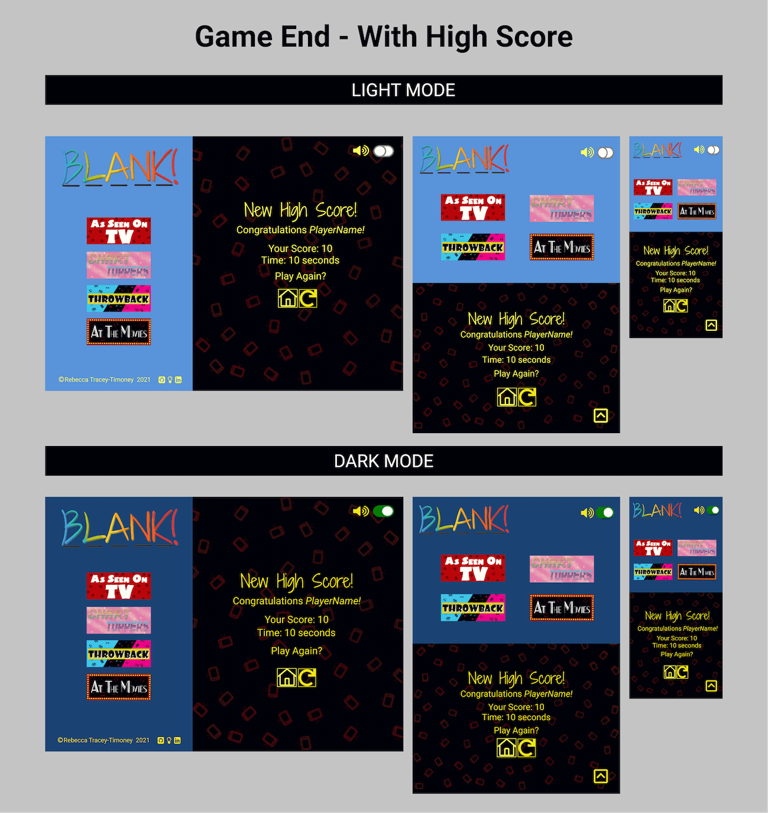
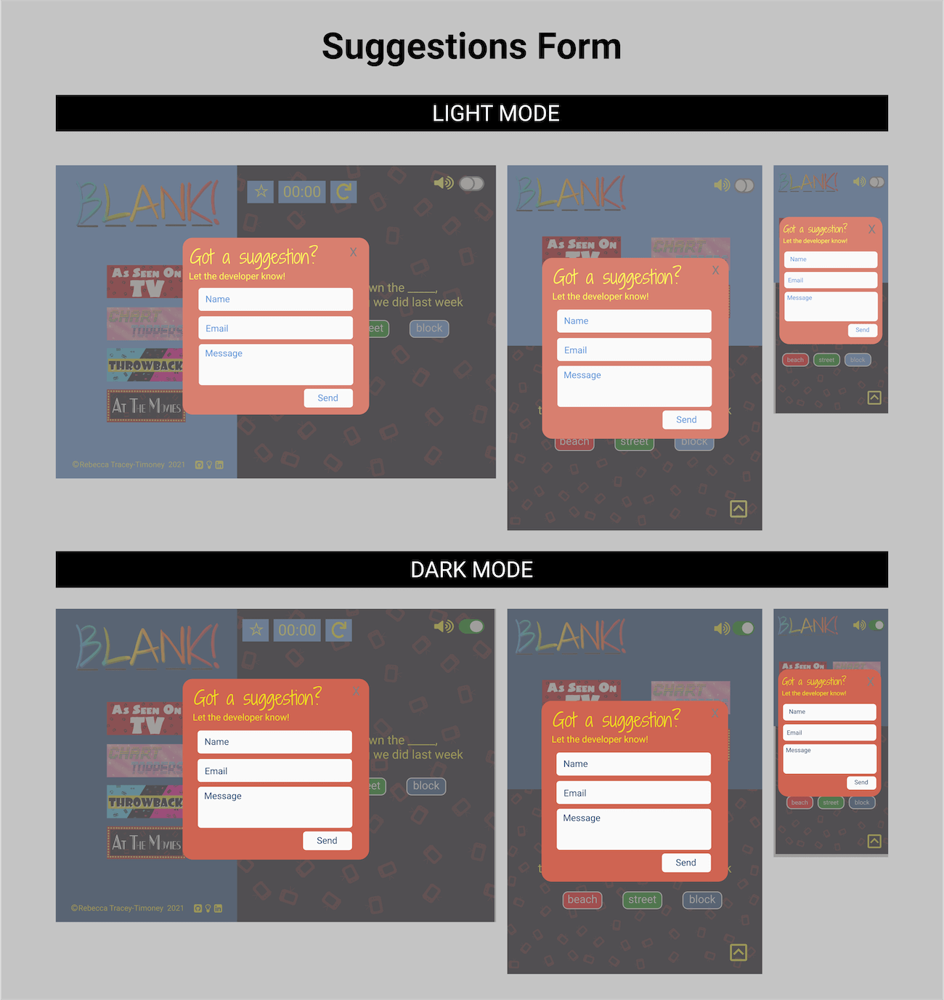

<h1 align="center">
     <a href="https://github.com/rebeccatraceyt/WhatsThatBlank" target="_blank"></a>
</h1>

<h2 align="center">
     <a href="https://github.com/rebeccatraceyt/WhatsThatBlank" target="_blank"></a>
</h2>

<div align="center">

Blank! is web-based interactive fill-in-the-blank game, with a musical twist. With a wide variety of music categories to choose from, the user can test their memory in their favorite music genre, using a fun and intuitive user interface. Features include vibrant graphics and sound effects, that the user can control for their own personal experience. The game is designed to be intuitively easy to navigate, requiring no prior knowledge or a list of instructions in how to play, getting the players to where they want to be: **in the game**!

[View the live project here](https://rebeccatraceyt.github.io/WhatTheBlank/)

</div>

## Table of contents
1. [UX](#UX)
    1. [Project Goals](#Project-Goals)
    2. [User Stories](#User-Stories)
    3. [Development Planes](#Development-Planes)
    4. [Design](#Design)
2. [Features](#Features)
    1. [Design Features](#Design-Features) 
    2. [Existing Features](#Existing-Features)
    3. [Features to Implement in the future](#Features-to-Implement-in-the-future)
3. [Issues and Bugs](#Issues-and-Bugs)
4. [Technologies Used](#Technologies-Used)
     1. [Main Languages Used](#Main-Languages-Used)
     2. [Frameworks, Libraries & Programs Used](#Frameworks,-Libraries-&-Programs-Used)
5. [Testing](#Testing)
     1. [Testing.md](TESTING.md)
6. [Deployment](#Deployment)
     1. [Deploying on GitHub Pages](#Deploying-on-GitHub-Pages)
     2. [Forking the Repository](#Forking-the-Repository)
     3. [Creating a Clone](#Creating-a-Clone)
7. [Credits](#Credits)
     1. [Audio](#Audio)
     2. [Code](#Code)
8. [Acknowledgements](#Acknowledgements)
***

## UX 
### Project Goals
The primary goal of Blank! is to provide a web-based interactive game, that is intuitive and entertaining, through a fill-in-the-blank game, designed to test the users music knowledge.

This is the second of four Milestone Projects that the developer must complete during their Full Stack Web Development Program at The Code Institute. 

The main requirements were to design, develop and implement a dynamic front-end web application using **HTML5**, **CSS3** and **JavaScript**.

#### Player Goals
The player is looking for:
- A fun and entertaining game to play
- Control over the page settings
- An intuitive and vibrant interface, that needs little to no instructions
- Visual and audio rewards during game mode

#### Developer / Site Owner Goals
The Developer is looking to:
- Create fun and entertaining game that they would play themselves
- Demonstrate their proficiency in a variety of software development skills, using newly learned languages and libraries and API's to achieve this goal
- Deploy a project they are excited to have on their portfolio


### User Stories
**As a player, I want to:**

1. Choose my own username, to personalize my game-playing experience.
2. Intuitively navigate to game mode, to have an easy gaming experience.
3. Have a clear score counter, to keep track of my score as I play.
4. Have a clear time counter, to keep track of time elapsed.
5. Get visual/auditory feedback on answers I choose, to see whether they were correct.
6. Have the ability to toggle sound effects on or off, to suit my preference.
7. Have to ability to choose the game theme (Day vs. Night Mode), to suit my preference.
8. View my highest session score.
9. Have the option to replay the game once I have finished to start again.
10. Provide suggestions to the developer to upgrade the game, enhancing my user experience.
11. Connect with the developer on a social platform of my choosing to see their other projects.


### Development Planes

In order to design and create a web-based interactive game, the developer distinguished the required functionality of the site and how it would answer the user stories, as described above. They then applied their research to the Five Development Planes:

<strong>1. <u>Strategy</u></strong>

Broken into three categories, the website will focus on the following target audiences:
- **Roles:**
     - New Players
     - Current Players
     - Returning Players

- **Demographic:**
     - Music Lovers
     - Aged 10 years and up
     - Quiz Lovers

- **Psychographics:**
     - Personality & Attitudes:
          - Extroverted
          - Fun-driven
          - Knowledgeable when it comes to music
     - Values:
          - Modern
          - Nostalgic
          - Friendship
     - Lifestyles:
          - Fun-seeking
          - Music interest
          - Competitiveness

The website needs to enable the **user** to:
- Play with easy, navigating without complications or instructions
- Choose their preferred music category
- Control sound settings
- Control light/dark settings
- See High Score
- Provide suggestions and feedback to the developer
- Connect with developer through social links

The website needs to enable the **client** to:
- Enjoy playing their own game
- Allow for user feedback and suggestions
- Communicate with users on social links

With these goals in mind, a strategy table was created to determine the trade-off between importance and viability with the following results:


<strong>2. <u>Scope</u></strong>

A scope was defined in order to clearly identify what needed to be done in order to align features with the strategy previously defined. This was broken into two categories:
- **Content Requirements**
     - The user will be looking for:
          - Vibrant and engaging content
          - Easy navigation throughout the game
          - Easy play interface
          - Control of sound settings
          - High Scores
          - Developer information
- **Functionality Requirements**
     - The user will be able to:
          - Navigate to preferred music category
          - Play with ease
          - Toggle Day vs Night graphics
          - See High Score
          - Toggle sound effects on and off
          - Reach out to the developer
               - Suggestions
               - Social links

<strong>3. <u>Structure</u></strong>

The information architecture was organized in a **hierarchial tree structure** in order to ensure that users could navigate through the site with ease and efficiency, with the following results: 


<strong>4. <u>Skeleton</u></strong>

Wireframe mockups were created in a [Figma Workspace](https://www.figma.com/file/aOGtRrWkTHhGUGqInODSdN/Blank "Link to Blank! Figma Workspace") with providing a positive user experience in mind:

Main Page:

- Welcome Modal:

     

- Home Page:

     

Game Mode:

- **As Seen on TV** Game Page:

     

- **Chart Toppers** Game Page:

     

- **Throwback** Game Page:

     

- **At The Movies** Game Page:

     


Finished Page:

- **With** High Score:

     

- **Without** High Score:

     

Form:

- 


<strong>5. <u>Surface</u></strong>


- <strong>Colour Scheme</strong>

     - The chosen colour scheme was specifically selected in order to define the tone of the application.

     - As the theme of the game is music related, the colour scheme mirrors the atmospheric setting of a music venue.

     - Drawing from research conducted on stage lights, and using the color contrast tool available at [Material.io](https://material.io/ "Link to material.io Homepage"), two colour palettes were created for a day-to-night feature toggle:

          - Light (Day Mode):

               

          - Dark (Night Mode):

               


- <strong>Typography</strong>

     - The primary font chosen is [Roboto](https://fonts.google.com/specimen/Roboto?preview.text_type=custom&query=roboto). A sans-serif typeface, Roboto is geometrically shaped and is easily readable.

     - The Secondary font (accent font) chosen is [Shadows into Light Two](https://fonts.google.com/specimen/Shadows+Into+Light+Two?preview.text_type=custom). A handwritten script typeface, it has rounded curves to emphasis a more playful and casual environment.

     - The charismatic combination of the two typefaces compliments the artistic aesthetic and entertaining theme set by the colour palette.

- <strong>Imagery</strong>

     - The imagery used was created by the developer using the application [Procreate](https://procreate.art/) in order to create a consistency of the elements while maintaining the look and feel of the application

[Back to top ⇧](#table-of-contents)

## Features

### Design Features
Each page of the game features a consistent responsive and intuitive navigational system:
- There is a conventionally placed **Logo** on the top left of each page. Clicking on the logo will redirect players back to the home page.
- To ensure the player has full control of the game, there are two **Toggle** functions conventionally located at the top right corner of each page. These allow the users to control the sound and page theme to their preference.
- On larger screens, the **Footer** is conventionally placed at the bottom of the screen, allowing users to navigate to the social icon of their choosing.
- On smaller screens, the **Footer** is placed within a sliding function, where users can click the appropriate icon in order to reveal the footer. This was to ensure that the footer would not interfere with the game-play.

<dl>
     <dt>
          <a href="https://rebeccatraceyt.github.io/WhatTheBlank/" target="_blank" alt="Blank! Home Page">Home Page</a>
     </dt>
     <dd>
          There is a conditional class in place that determines what content the user will see when they enter the website. Based on whether the user has already provided a <strong>Player Name</strong>, the user will see one of the following:
               <ul>
                    <li>
                         <strong>Welcome Menu</strong> - A full-screen welcome menu, introducing the user to the game, providing the basics in how the game works and prompting them to enter a player name of their choice. 
                    </li>
                    <li>
                         <strong>Home Page</strong> - When the user has entered their chosen name, or if they have previously already entered this information, the user will see the home page. Again, a full-screen page, the home page provides a point of navigation for the players to start the game in the category of their choosing.
                    </li>
               </ul>
     </dd>
     <dt>
          <a href="https://rebeccatraceyt.github.io/WhatTheBlank/as-seen-on-tv.html" target="_blank" alt="Blank! As Seen On TV Game Page">Game Play Page</a>
     </dt>
     <dd>
          There are four identical game-play pages in total, each representing a different category of music. Each page is individually styled, but the general layout and functionality are the same in order to maintain consistency throughout the game. Each page has the following features:
          <ul>
               <li>
                    <strong>Menu Section</strong> - The Menu section is conventionally placed on the left of the screen, taking up 30% of the viewport width on larger screens and 30% of the viewport height on smaller screens. It displays:
                         <ul>
                              <li>
                                   <strong>Category Buttons</strong> - Allowing users to navigate to other categories, as they wish.
                              </li>
                              <li>
                                   <strong>Footer</strong> - Depending on the device, the footer will be automatically displayed or be hidden in a <strong>sliding footer</strong>, providing links to the developers chosen social media as well as a <strong>form</strong>, allowing users to make suggestions for improvement.
                              </li>
                         </ul>
               </li>
               <li>
                    <strong>Game Play Section</strong> - The Game Play section takes up the remainder of the page, providing ample game playing space. Within the game play, there are a number of features to create a more interactive environment for the user to enjoy:
                    <ul>
                         <li>
                              <strong>Questions and Answers</strong> - The primary focus of the section is the questions and answers. These are called in at random and take up the majority of the space, in order to sustain readability.
                         </li>
                         <li>
                              <strong>Heads Up Display</strong> - Conveniently placed in the players eye-line, the heads up display provides gaming functions such as:
                                   <ul>
                                        <li>
                                             <strong>Score Counter</strong> - Starting of, the score counter is represented by a star icon to represent a score and, as the player starts playing, it is replaced and incremented by 1 each time the player gets the answer correct, the score counter provides visual feedback for user to know how they are doing.
                                        </li>
                                        <li>
                                             <strong>Time Keeper</strong> - The time keeper function provides realtime time elapse of how long the player has been playing that particular round for. This is then displayed at the end.
                                        </li>
                                        <li>
                                             <strong>Home Button</strong> - A home button allows the user to return to the home page.
                                        </li>
                                        <li>
                                             <strong>Restart Button</strong> - A restart button allows the user to refresh the page, starting back at 0, for their convenience.
                                        </li>
                                   </ul>
                         </li>
                         <li>
                              <strong>Game End</strong> - Once the player has answered all questions, they will be directed to the game-end feature. This is still a part the game-play page, showing the conditional information based on the users score. This was to avoid redirecting to another page, and allowed for custom styling for each page.
                         </li>
                    </ul>
               </li>
          </ul>
     </dd>
</dl>

### Existing Features
- **Personalised Player Name** - When the user first opens the page, they will be prompted to enter a player name of their choice. This name is then used to personalise their in-game experience.

- **Logo** - Appearing on every page for brand recognition. Clicking the logo will return the user to the home page, as expected.

- **Mute Button** - Appearing on every page for convenience, this feature allows the user to choose their sound preferences, then stores this choice in the pages' `sessionStorage`, applying it to all pages on the site. The button uses appropriate icons to represent the sound state.

- **Dark Mode Toggle** - Appearing on every page for convenience, this feature allows the user to control the theme to be used, allowing a selection between 'light mode' and 'dark mode'. Each providing a different colour experience for the user. Should the user already have a stored system theme on their device, the page will use this as default.

- **Social Icons** - On each page, in the footer (regardless of whether this is the standard or sliding footer) the developers' chosen social platforms are displayed using appropriate icons.

- **Suggestions Form** - As well as the social media icons, there is also a form feature, allowing users to submit their suggestions or comments to the developer. The form uses an appropriate icon for consistency. On form submission, both the developer and the user will get an email, confirming the message has been sent.

- **Answer Feedback** - The answer buttons provide users with both visual and aural feedback, displaying whether they are correct in their choice.

- **Score Counter** - Incrementing by 1 each time the correct answer is selected, the counter provides real-time information as to the players score. It is represented by an icon on page load as a visual cue of what will be there as they begin to play/. This is then displayed at game end. The score is then compared to the session High Score for competitiveness purposes.

- **Time Counter** - A time counter, displaying the time elapsed since page load, gives users feedback on how long they have been playing, in minutes and seconds. This is then displayed at game end.

- **Page Loader** - As the questions are being called in JavaScript, there is a slight delay in loading. In order to create a more user-friendly experience, a loader icon (appropriately shaped as a compact disc) displays first on all game pages, until the questions have been loaded.

- **Session Storage** - The `sessionStorage` function is used to store user information such as **username**, player's **high score** and the chosen **user preferences**.

- **404 page** - A 404 page is provided, should something go wrong, with a **call-to-action** button, redirecting the user back to the homepage.

### Features to Implement in the future
- There are two categories that the developer would like to implement in future releases:
     - **Beat The Clock**
          - Allowing users to race against the clock in their chosen category. 
          - The developer did try to implement this feature in the current release but it created a bug that was, unfortunately, beyond their skill level. After further learning, the developer hopes to tackle this.
     - **Random Round**
          - A category that would call in a random question from the provide arrays to create a completely random set of questions for players.
          - The developer held off on this feature in the current release in order to further develop their skills to be able to implement the feature properly. Although a simplified version could have been implemented, the developer believed that it would not do the name justice.
- An online leadership board, allowing players to see the High Scores of other players.
     - This would require the use of a database in order to implement.
- Branching out into other versions of the game, for example:
     - Famous Sayings
          - Poets
          - Literature
          - Idioms
          - Quotes
     - Movie Quotes
          - Cult Classics
          - Action
          - Family
          - Random
     - Although this was the original plan for the game, the developer scaled the scope, choosing to focus on one version; Music.

[Back to top ⇧](#table-of-contents)

## Issues and Bugs 
The developer ran into a number of issues during the development of the websites, with the noteworthy ones listed below, along with solutions or ideas to implement in the future.

**Sliding Footer Bug** - A bug was detected in the sliding footer feature when being implemented. As the developer sourced and edited the code from [JSFiddle](http://jsfiddle.net/nathanbweb/JHu7j/), the problem lay in integrating that code with the original. The sourced code was overriding the html within the code and, as such, created problems with the graphics that were to be used. In order to fix this, the developer instead toggled the necessary classes and elements. In their research, the developer found a similar problem on [Stack Overflow](https://stackoverflow.com/questions/15345784/change-icon-on-click-toggle/15345885) where they then implemented this into their code, with success.

**Welcome Modal Bug** - On page load, the welcome modal appears allowing users to enter a username of choice. The problem with the modal was that, by default, clicking outside the modal area would close the modal and, as the modal was full-screen, it was possible for the user to click anywhere on the modal to close it. With this, the player could bypass the username entry, rendering it null. In order to fix this, the developer researched a method to disable this default, finding a solution on [Stack Overflow](https://stackoverflow.com/questions/22207377/disable-click-outside-of-bootstrap-modal-area-to-close-modal), whereby the modal would only close on click of the submit button (after filling out the required field). 

As well as this, there was an issue with the modal, whereby the modal would continue to refresh as the user entered their username. The reason for this was a conflict issue between the `data-dismiss` attribute and `localStorage`, where it would not register the name as a username, but dismiss the modal anyway. To rectify this, and to learn for future reference, the developer turned to [Slack](https://slack.com/intl/en-ie/) to get examples of previous methods. With this new knowledge, the developer was able to tackle the problem. They would like to extend their deepest gratitude to those fellow students.

**Game Play Categories issues** - The original plan for the game was to use one page and iterate an array depending on the category button that the user clicked. This method created an overlapping issue within the JavaScript `script.js` file and the page would not function as designed. In order to save the functionality of the game, the developer decided to divide the categories into their own pages (both `.html` and `.js`), with each page executing their own functions during game-play.

**Game Ending Page issues** - In the original design, there was to be a separate page that players would be redirected to after answering all questions, thus completing the quiz. The page content would change, depending on which of the two probable outcomes of game play (*high score* or *no high score*) the user had. Straight away, the developer faced a similar problem to the **Game Play Categories** issue, where there became an overwhelming overlap in the `script.js` file. To over come this, the developer removed the ending page entirely, and directly applied the end of the game to each specific category. This allowed for a high score in each category as well as an accurate pointing system that was not possible with one page.

**Mute Button Bug** - One of the biggest challenges the developer met in the developmental process was the *mute button* feature. The feature allows users to manage the audio setting of the game, toggling the sound effects on and off. In implementing it, the developer's knowledge was challenged to the fullest in ensuring that the preference the user set on one page would carry through to the next page. In their learning, the developer was able to create the necessary functions and conditions that allowed the feature to work, storing the preference for the next page. Although it tested their knowledge, the reward of successfully implementing it was worth it. 

**Email Validation Issue** - For the **Suggestions Form** the design was to create a modal form that could only be submitted once all areas were complete and, on submission, the user would receive a success message, providing them with the necessary feedback. The problem with this was that, by default, the modal button would override this validation, closing the modal regardless of whether the user had actually inputted any information. In order to rectify this, the developer used the [jQuery Validation](https://jqueryvalidation.org/ "Link to jQuery Validation page") plugin that would allow for jQuery to validate the form, which could then allow for a conditional response, when the form was validated.

**Background image bug** - The is a background image rendered for both the **welcome modal** and **homepage**. With the known issue regarding `background-size: cover` and ios devices, the developer had to create a work around to be able to call on the background image conditional to the current theme set. In order to do this, the images had to be rendered in JavaScript, as opposed to CSS.

**Common variables in JavaScript Issue** - The JavaScript was divided into five files, one for each game category (for functionality), and one for common variables and functions, e.g. form validation. The problem with this was that some variables needed be called in both the category file and script file. This overlap lead to errors in testing as to separately declare the variables in each page would throw an `already declared` error, but to declare them in only one would cause validation errors. In order to fix this, the developer changed each of the internal js file types to `type="module"` and used `import` and `export` as needed. This avoided the validation issue while maintaining functionality. 


[Back to top ⇧](#table-of-contents)

## Technologies Used
### Main Languages Used
- [HTML5](https://en.wikipedia.org/wiki/HTML5 "Link to HTML Wiki")
- [CSS3](https://en.wikipedia.org/wiki/Cascading_Style_Sheets "Link to CSS Wiki")
- [JavaScript](https://en.wikipedia.org/wiki/JavaScript "Link to JavaScript Wiki")

### Frameworks, Libraries & Programs Used
- [Bootstrap](https://getbootstrap.com/docs/4.4/getting-started/introduction/ "Link to Bootstrap page")
     - Bootstrap was used to implement the responsiveness of the site, using bootstrap classes.
- [jQuery](https://jquery.com/ "Link to jQuery page")
     - jQuery was used to simplify the JavaSCript code used
- [Google Fonts](https://fonts.google.com/ "Link to Google Fonts")
    - Google fonts was used to import the fonts "Shaodows Into Light Two" and "Roboto" into the style.css file. These fonts were used throughout the project.
- [Font Awesome](https://fontawesome.com/ "Link to FontAwesome")
     - Font Awesome was used on all pages throughout the website to import icons (e.g. social icons) for UX purposes.
- [Git](https://git-scm.com/ "Link to Git homepage")
     - Git was used for version control by utilizing the GitPod terminal to commit to Git and push to GitHub.
- [GitHub](https://github.com/ "Link to GitHub")
     - GitHub was used to store the project after pushing
- [jQuery Validation](https://jqueryvalidation.org/ "Link to jQuery Validation page")
     - jQuery Validation was used to simplify form validation for the **Suggestions Form**
- [SweetAlert2](https://sweetalert2.github.io/ "Link to Sweet Alert 2 page")
     - SweetAlert2 was used to customise the **Suggestions Form** success message for UX purposes
- [Figma](https://www.figma.com/ "Link to Figma homepage")
     - Figma was used to create the wireframes during the design phase of the project.
- [Am I Responsive?](http://ami.responsivedesign.is/# "Link to Am I Responsive Homepage")
     - Am I Responsive was used in order to see responsive design throughout the process and to generate mockup imagery to be used.

[Back to top ⇧](#table-of-contents)

## Testing

Testing information can be found in a separate testing [file](TESTING.md "Link to testing file")

## Deployment

This project was developed using [Visual Studio Code Insiders](https://code.visualstudio.com/insiders/ "Link to Visual Studio Code site"), committed to git and pushed to GitHub using the computer terminal.

### Deploying on GitHub Pages
To deploy this page to GitHub Pages from its GitHub repository, the following steps were taken:

1. Log into [GitHub](https://github.com/login "Link to GitHub login page") or [create an account](https://github.com/join "Link to GitHub create account page").
2. Locate the [GitHub Repository](https://github.com/rebeccatraceyt/WhatTheBlank "Link to GitHub Repo").
3. At the top of the repository, select Settings from the menu items.
4. Scroll down the Settings page to the "GitHub Pages" section.
5. Under "Source" click the drop-down menu labelled "None" and select "Master Branch".
6. Upon selection, the page will automatically refresh meaning that the website is now deployed.
7. Scroll back down to the "GitHub Pages" section to retrieve the deployed link.
8. At the time of submitting this Milestone project the Development Branch and Master Branch are identical.

### Forking the Repository
By forking the GitHub Repository we make a copy of the original repository on our GitHub account to view and/or make changes without affecting the original repository by using the following steps...

1. Log into [GitHub](https://github.com/login "Link to GitHub login page") or [create an account](https://github.com/join "Link to GitHub create account page").
2. Locate the [GitHub Repository](https://github.com/rebeccatraceyt/WhatTheBlank "Link to GitHub Repo").
3. At the top of the repository, on the right side of the page, select "Fork"
4. You should now have a copy of the original repository in your GitHub account.

### Creating a Clone
How to run this project locally:
1. Install the [GitPod Browser](https://www.gitpod.io/docs/browser-extension/ "Link to Gitpod Browser extension download") Extension for Chrome.
2. After installation, restart the browser.
3. Log into [GitHub](https://github.com/login "Link to GitHub login page") or [create an account](https://github.com/join "Link to GitHub create account page").
2. Locate the [GitHub Repository](https://github.com/rebeccatraceyt/WhatTheBlank "Link to GitHub Repo").
5. Click the green "GitPod" button in the top right corner of the repository.
This will trigger a new gitPod workspace to be created from the code in github where you can work locally.

How to run this project within a local IDE, such as VSCode:

1. Log into [GitHub](https://github.com/login "Link to GitHub login page") or [create an account](https://github.com/join "Link to GitHub create account page").
2. Locate the [GitHub Repository](https://github.com/rebeccatraceyt/WhatTheBlank "Link to GitHub Repo").
3. Under the repository name, click "Clone or download".
4. In the Clone with HTTPs section, copy the clone URL for the repository.
5. In your local IDE open the terminal.
6. Change the current working directory to the location where you want the cloned directory to be made.
7. Type 'git clone', and then paste the URL you copied in Step 3.
```
git clone https://github.com/USERNAME/REPOSITORY
```
8. Press Enter. Your local clone will be created.

Further reading and troubleshooting on cloning a repository from GitHub [here](https://docs.github.com/en/free-pro-team@latest/github/creating-cloning-and-archiving-repositories/cloning-a-repository "Link to GitHub troubleshooting")

[Back to top ⇧](#table-of-contents)

## Credits 

### Audio
The sound effects and song lyrics that are used in this website are for educational purposes only. There is no copyright infringement intended.

Music and sound effect credits can be found in a separate [file](CREDITS.md "Link to credits file")

### Code 
The developer consulted multiple sites in order to better understand the code they were trying to implement. For code that was copied and edited, the developer made sure to reference this with the code. The following sites were used on a more regular basis:
- [Stack Overflow](https://stackoverflow.com/ "Link to Stack Overflow page")
- [W3Schools](https://www.w3schools.com/ "Link to W3Schools page")
- [Bootstrap](https://getbootstrap.com/ "Link to BootStrap page")
- [JSfiddle](https://jsfiddle.net/ "Link to JSfiddle page")

For the basic functionality of the game play mode of the site, the developer sourced a similar project by [JamesQQuick](https://github.com/jamesqquick/Build-A-Quiz-App-With-HTML-CSS-and-JavaScript "Link to Build-A-Quiz repo") and was able to edit and manipulate it in order to design the game to their specifications.

[Back to top ⇧](#table-of-contents)

## Acknowledgements
- I would like to thank my mentor Seun for her unwavering encouragement and guidance throughout.
- I would like to thank my friends and family for their never-ending encouragement and valued opinions during the entire process of development.

[Back to top ⇧](#table-of-contents)

***