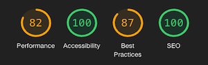

# Blank! - Testing 

[Main README.md file](README.md "Link to README file")

[View live project](https://rebeccatraceyt.github.io/WhatTheBlank/ "Link to Live project")

[View website in GitHub Pages](https://github.com/rebeccatraceyt/WhatTheBlank "Link to Blank! Repository")

***
## Table of contents
1. [Testing User Stories](#Testing-User-Stories)
2. [Manual Testing](#Manual-Testing)
3. [Automated Testing](#Automated-Testing) 
     - [Code Validation](#Code-Validation)
     - [Browser Validation](#Browser-Validation)
     - [Lighthouse Auditing](#Lighthouse-Auditing)
4. [User Testing](#User-Testing)

***

## Testing User Stories

#### Player Goals:
1. As a player, I want to choose my own username, to personalize my game-playing experience.
    - On entry of the site, if there is no username stored, the player will be presented with a welcome menu.
    - This menu prompts the user to enter the player name of their chose.
    - This name is then called on game-end to personalize the users gaming experience.
2. As a player, I want to intuitively navigate to game mode, to have an easy gaming experience.
    - When the user has entered their player name, they are directed to the home page, which displays the various categories available.
    - Users are prompted to **Choose A Category**. In doing so, they will then be directed to the category page of their choosing.
3. As a player, I want to have a clear score counter, to keep track of my score as I play.
    - The score counter is displayed in the heads-up-display of the game-play section. 
    - It is incremented by 1 each time the user selects the correct answer.
    - Players can watch their score go up as they progress.
    - The player's final score is then displayed in the game-end, allowing users to view their score and compare it to their high score in that category.
4. As a player, I want to have a clear time counter, to keep track of time elapsed.
    - The time counter is displayed in the heads-up-display of the game-play section.
    - The timer begins on page loads and measures the time elapsed in `seconds` for readability.
    - The player's final time is then displayed in the game-end.
5. As a player, I want to get visual/auditory feedback on answers I choose, to see whether they were correct.
    - As the player selects their chosen answer, one of two things occur:
        - If the answer is correct, the button turns green, visually signifying they are correct, and a sound plays, providing positive auditory feedback.
        - If the answer is incorrect, the selected button turns red and the correct answer turns green, providing visual feedback, with a more negative sound playing to provide the appropriate auditory response. 
6. As a player, I want to have the ability to toggle sound effects on or off, to suit my preference.
    - A mute button appears on all pages, conventionally placed in the `navbar` area of the top right corner.
    - There the user can choose whether they want to mute or un-mute.
    - This preference is then stored in the `sessionStorage`, to create a default setting for all pages.
7. As a player, I want to have to ability to choose the game theme (Day vs. Night Mode), to suit my preference.
    - Similarly to the mute button, the toggle function is placed in the top right corner.
    - With appropriate icons, the user can choose day or night mode.
    - This choice is then stored in the `localStorage` to become the default setting across all pages, and for future visits.
    - As well as this, if the user already has system theme preferences selected on the device they are using, the game will reflect that preference.
8. As a player, I want to view my highest session score.
    - When the player completes all questions, a condition determines the text they will be presented with:
        - If their score is the new high score, they will see the **New High Score** details, showing their score. This is then logged in `sessionStorage`.
        - If their score is less than the high score, they will see the **No High Score** details, showing their score, as well as the current high score.
9. As a player, I want to have the option to replay the game once I have finished to start again.
    - Once they have completed all questions, the player will be presented with the game-end text. 
    - No matter their score, the player will have the option to **play** again (or to **try** again), using an appropriate **redo** icon.
    - They also have the option to restart during the game, clearing their score and time.
10. As a player, I want to provide suggestions to the developer to upgrade the game, enhancing my user experience.
    - In the footer, the user can access a suggestions form, allowing them to send a message to the developer.
    - Using **EmailJS**, the form is validated and will send a message to both the developer and the sender.
11. As a player, I want to connect with the developer on a social platform of my choosing to see their other projects.
    - In the footer, there are appropriate icons indicating the developers selected social platforms.
    - Conventionally, these links open in a new tab.

[Back to top ⇧](#Blank---Testing)

## Manual Testing

### Common Elements Testing
Manual testing was conducted on the following elements that appear on every page:

- Clicking the **Mute Button** will trigger an icon change

    

- This preference is stored and will be default for all pages

    

- Clicking the **Toggle Function** will show the appropriate icon for the current theme
        
    

- This preference is stored and will be default for all pages

    

- Clicking the icon will trigger the **Sliding Footer** on smaller screens

    

- Clicking on social media icons will open them in a new tab

    

    

- Clicking on the icon will open the **Form Modal**

    

### Home Page
Manual testing was conducted on the following elements on the Home Page:

- On first load, the user will be directed to the welcome menu, where they will be prompted to enter a player name before entry

    

- Clicking logo on left of screen will refresh the landing page

     

- On a mobile device, the category buttons stacks on top of each other for UX purposes

     

- The responsiveness of the Home page
    - Welcome Menu
        
        

    - Home Page

        

### Game Play Page
Manual testing was conducted on the following elements on the Game Play Page:

- Clicking logo on left of screen will redirect user back to Home Page

    

- If there is a delay in the loading of the questions, a **Page Loader** will be displayed

    

- On page load, the **Time Counter** begins 

    

- If the player wishes to restart mid-game, they click the restart button in the heads-up display

    

- When player chooses correct answer, they will be provided feedback and their score will be incremented by 1

    

- When player chooses incorrect answer, they will be provided feedback on both the correct and incorrect choice

    

- On page end, the player's score will determine the text they will be presented with:

    - When they have reached a High Score
    
        
    
    - When they have not reached a High Score

        

- When they click on the **replay** icon, they will be redirected back to the start

    

- The responsiveness of the Game Play Page

     

[Back to top ⇧](#Kryan-Live---Testing)

## Automated Testing

### Code Validation
The [W3C Markup Validator](https://validator.w3.org/) service was used to validate the `HTML` code used.

**Results:**

- Home Page

     

- As Seen on TV Category Page

     

- Chart Toppers Category Page

     

- Throwback Category Page

     

- At The Movies Category Page

     

The [W3C CSS Validator](https://jigsaw.w3.org/css-validator/) service was used to validate the `CSS` coded used.

**Results:**

### Browser Validation
- Chrome - 
- Safari - 
- Edge - 
- Opera - 
- Firefox - 

### Lighthouse Auditing
- Welcome Menu - 

- Home Page - 

- Game Play Page - 

Issues were related to render-blocking resources. No recommendations in this report have been implemented in the first release but will be looked into for future releases.

[Back to top ⇧](#Kryan-Live---Testing)

## User testing 
Friends and family members were asked to review the site and documentation to point out any bugs and/or user experience issues. Their helpful advice throughout the process led to many UX changes in order to create a better experience. 

It was through this testing that the following changes were made:
- Change to the Navbar background color on mobiles in order for the toggler menu icon to more distinguishable to the background image.
- Change to Navbar font-size on mobile for clearer reading.
- Complete overhaul of Live page in order to display the information in a more user-friendly way.

[Back to top ⇧](#Kryan-Live---Testing)

***